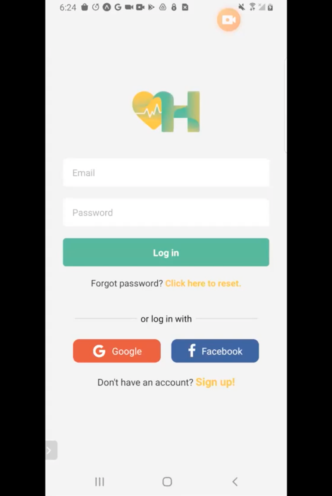

# My Second Blog Post
---
Hello, world! Welcome to my blog. I'm excited to share my thoughts, experiences, and insights with you. In this first post, I want to introduce myself and give you a glimpse into what you can expect from this blog.

## About Me

I'm **John Doe**, a passionate software developer based in **San Francisco**. I've always had a keen interest in technology, and this blog will serve as a platform for me to share my knowledge and experiences in the world of programming.

## What to Expect

On this blog, you can expect a variety of content, including all these things:

### 1. Exploring the Latest JavaScript Trends

I'll be diving into the ever-evolving JavaScript ecosystem and exploring various aspects of it. Whether it's sharing tips and tricks, reviewing the latest JavaScript frameworks, or discussing industry trends, I aim to create valuable content for fellow developers.

### 2. Coding Adventures in Web Development

Another area of interest for me is web development. I'll be sharing my experiences, challenges, and successes in building web applications, hoping to inspire and connect with others who share a passion for web development.

### 3. Tech Reviews and Gadgets

Tech gadgets have always fascinated me. From the latest smartphones to cool programming gadgets, I'll be sharing reviews and insights on exciting tech products to keep you in the loop.

## Get Involved

I encourage you to leave comments and engage in discussions. Your thoughts and feedback are valuable to me, and I'm looking forward to building a community around our shared interests.

Thank you for joining me on this journey. Stay tuned for more posts coming your way!

Happy coding!

**John Doe**